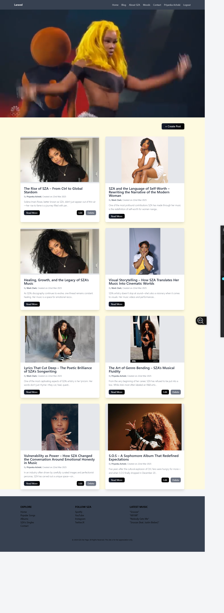
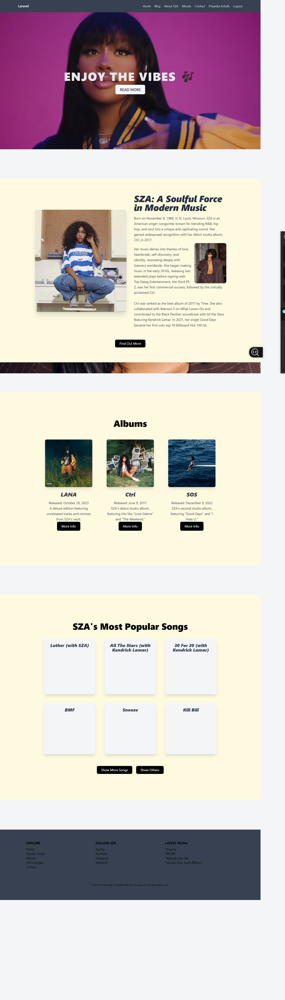

# SZA Mood Portal – Laravel 8

Explore the moods, messages, and magic in SZA's music through this Laravel 8 application. The project allows users to log in and view blog posts, playlists, and song insights categorized by emotional vibes.

---

## Features

- Mood-based blog navigation
- Embedded Spotify playlists
- Auth-protected content
- Tailwind-powered responsive UI
- Smooth transitions and portals

---

## Demo

[Watch the Screencast](https://drive.google.com/file/d/10kcQdVJ3YlTKtcONw_SPEG5VPaxyfl0_/view?usp=drive_link)

---

## Screenshots

### Blog Page



### Homepage + Albums + Mood Explorer



---

## Requirements

- PHP 7.3 or higher  
- Composer  
- Node.js 12.13.0 or higher  
- MySQL

---

## Installation

```
git clone https://github.com/Priachoki/blog_CA2.git
cd blog_CA2
composer install
npm install && npm run dev
cp .env.example .env
php artisan key:generate
php artisan cache:clear && php artisan config:clear
```

---

## Database Setup

```
CREATE DATABASE sza_moods;
```

Update your `.env` file:

```
DB_CONNECTION=mysql
DB_HOST=127.0.0.1
DB_PORT=3306
DB_DATABASE=sza_moods
DB_USERNAME=your_username
DB_PASSWORD=your_password
```

Run migrations and seeders:

```
php artisan migrate --seed
php artisan serve
```

Access the app at: [http://localhost:8000](http://localhost:8000)

---

## Project Structure

| Folder | Description |
|--------|-------------|
| `views/` | Blade templates for blog and moods |
| `routes/` | Web routes |
| `public/` | Frontend assets |
| `database/seeders/` | Mood and song data |

---

## Tasks

- [x] Set up Laravel project
- [x] Build blog & mood views
- [x] Add authentication
- [x] Embed Spotify players
- [ ] Add admin mood editor

---

## Author

### Created by: **Priyanka**

---

## License

MIT License

---

> "_Why is it so hard to accept the party is over?_"  
> — SZA, *Drew Barrymore*
